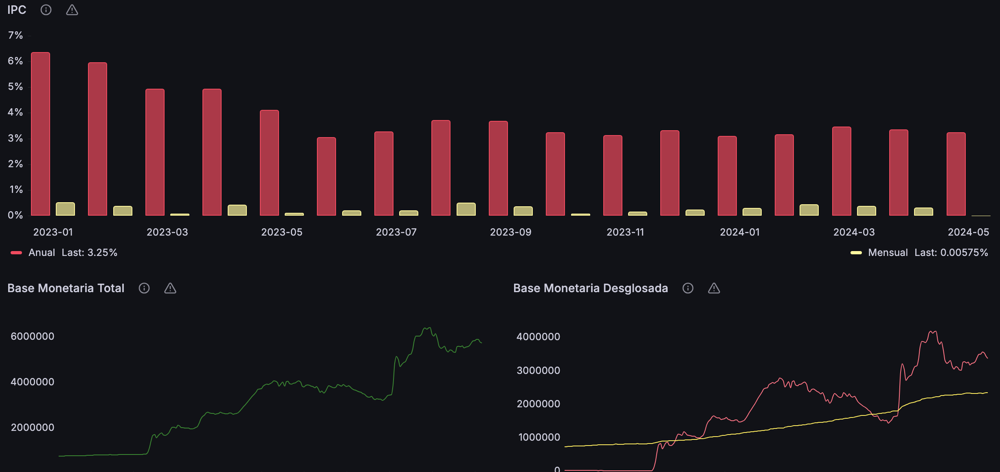

## Description

Financial System Observer API is a Web API developed in ASP.NET whose objective is to obtain information about financial markets for subsequent analysis. It is based on consuming endpoints provided by the St. Louis Federal Reserve and graphing the information obtained through Grafana, in turn having a user management system with roles and permissions to maintain its security.

## Index

- [Description](#Description)
- [Technologies](#Technologies)
- [URL](#URL)
- [Endpoints](#endpoints)
  - [Sesion](#Sesion)
  - [Series](#Series)
  - [Users](#Users)
- [Contact](#Contact)
- [Grafana](#Grafana)
- [FREDs](#FREDs)
- [Soon](#Soon)

## Technologies

- ASP.NET Core
- Entity Framework Core
- Swagger
- PostgreSQL
- Docker
- Git
- Github Actions
- Grafana
- xUnit

## URL

https://fsobserverapi.onrender.com/swagger/index.html

## Endpoints

- **https://fsobserverapi.onrender.com**: Root

### Sesion

- **GET /sesion/login?Email=user@example.com&Password=user**: Returns a JWT to authenticate.
- **POST /sesion/register**: Register a user.

### Series

- **GET /series/search?search_text=unemployment**: Gets a lookup of the data.
- **GET /series/observation?series_id=unrate**: Gets the data.

### Users 

Need role admin
- **GET /user/get**: Gets the list of users.
- **GET /user/get/{id}**: Gets a user by ID.
- **POST /user/add**: Create a new user.
- **PUT /user/update/{id}**: Update an existing user.
- **DELETE /user/delete/{id}**: Delete a user.

## Contact

- Email: eloycruzmartin@gmail.com

## Grafana

Dashboard example

## FREDs

https://fred.stlouisfed.org/docs/api/fred

## Soon

SEC Api
Documentation
https://www.sec.gov/edgar/sec-api-documentation

Sec Filings
https://data.sec.gov/submissions/CIK##########.json

All information about a specific company
https://data.sec.gov/api/xbrl/companyfacts/CIK##########.json

All the information about a concept
https://data.sec.gov/api/xbrl/companyconcept/CIK##########/us-gaap/AccountsPayableCurrent.json

The information of all the companies for a concept and a date
https://data.sec.gov/api/xbrl/frames/us-gaap/AccountsPayableCurrent/USD/CY2023Q4I.json
